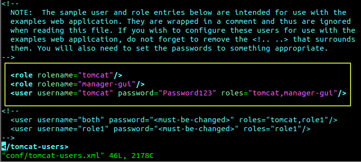
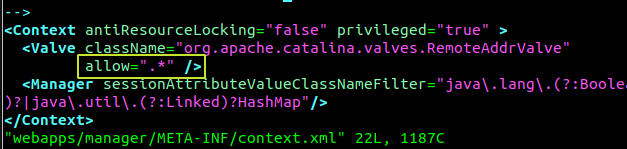
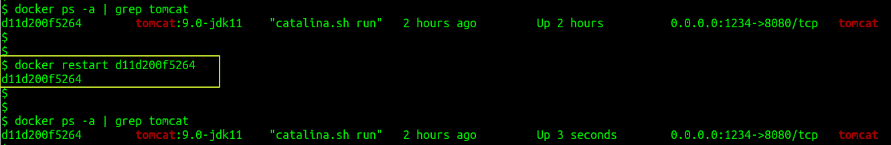
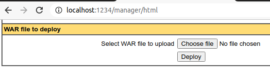
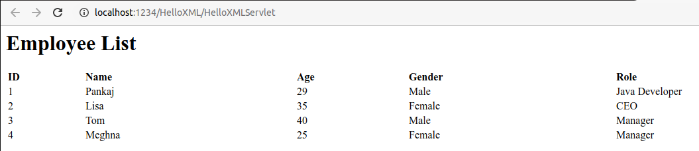

# XXE: Attack Environment Setup

1. Create a docker volume called `tomcat-volume`

        docker volume create tomcat-volume

2. Start a Tomcat container by running following Docker command

        docker run -d -p 1234:8080 --name tomcat \
        -v tomcat-volume:/usr/local/tomcat \
        tomcat:9.0-jdk11

3. Find the actual path of the volume

        docker volume inspect tomcat-volume

4. Access the folder used by `tomcat-volume`, and, edit `conf/tomcat-users.xml` file. Add following lines

        <role rolename="tomcat"/>
        <role rolename="manager-gui"/>
        <user username="tomcat" password="Password123" roles="tomcat,manager-gui"/>

    

5. By default, Tomcat allows Manager App access only if the browser is on the same machine as the server. To lift this restriction, access the file `webapps/manager/META-INF/context.xml` in the volume and change the allow string as below

        <Valve className="org.apache.catalina.valves.RemoteAddrValve"
        allow=".*" />

    

6. Restart the Tomcat container to make the configuration changes effective.

        docker restart CONTAINER_ID

    

7. Navigate to http://localhost:1234/
8. Click on **Manager App** button 
9. Enter the credentials configured in step #4, i.e. `tomcat`:`Password123`

10. Download WAR file [from here](artifact/HelloXML.war)
11. In the Tomcat manager page at http://localhost:1234/manager/html, scroll down to `WAR file to deploy` section

    

12. Upload the downloaded WAR file
13. Click on **Deploy** button
14. Create `employees.xml` file

    ```xml
    <?xml version="1.0" encoding="UTF-8"?>
    <Employees>
        <Employee id="1">
            <age>29</age>
            <name>Pankaj</name>
            <gender>Male</gender>
            <role>Java Developer</role>
        </Employee>
        <Employee id="2">
            <age>35</age>
            <name>Lisa</name>
            <gender>Female</gender>
            <role>CEO</role>
        </Employee>
        <Employee id="3">
            <age>40</age>
            <name>Tom</name>
            <gender>Male</gender>
            <role>Manager</role>
        </Employee>
        <Employee id="4">
            <age>25</age>
            <name>Meghna</name>
            <gender>Female</gender>
            <role>Manager</role>
        </Employee>
    </Employees>
    ```

15. Find the container ID by running following Docker command

        docker ps -a | grep tomcat

16. Copy `employees.xml` into the running container

        docker cp employees.xml CONTAINER_ID:/var/tmp/employees.xml

17. Acess following URL in a browser window - http://localhost:1234/HelloXML/HelloXMLServlet

    

## References

* https://www.journaldev.com/1198/java-sax-parser-example
* https://learnsomethingquick.wordpress.com/2018/08/23/docker-java-servlet-with-tomcat/
* https://www.vogella.com/tutorials/EclipseWTP/article.html
* https://staaldraad.github.io/2016/12/11/xxeftp/
